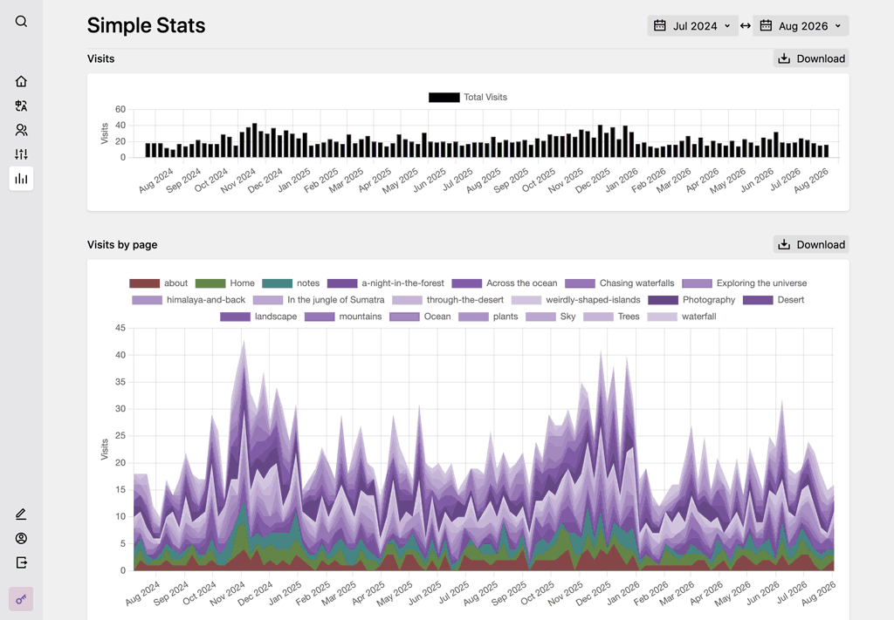

# SimpleStats

Track page views, referrers and devices on your Kirby website.  
This plugin provides a simple solution for **self-hosted**, **minimal** and **non-intrusive** visitor analytics.

### Tracking Features :

- **Referrer URLs** to keep track of who links to your website, categorised as either `search`, `social` or `website`.
- **Device information** (device types, browser engine, OS family; all version-less) for keeping track of how your website is visited.
- **Page visits**, counting 1 hit per page visit per unique user per language, every 24H.

### Data Collection :

- **Anonymised and processed** according to a daily/weekly/monthly/custom timeframe.
- **Stored** in a single **.sqlite database** (versatile, easy to backup).
- **Exposed** through the `Stats` class (for usage in your frontend).
- **Visualised** in a **panel area** using charts, and a **page section** shows page specific data.

****

### Getting Started

For installation, configuration, integration, usage, and development see [SETUP.md](SETUP.md).

****

### Credits

#### Powered by

- [Chart.js](https://www.chartjs.org) for displaying interactive charts. [[*MIT*](https://github.com/chartjs/Chart.js/blob/master/LICENSE.md)]
- Package managers and packers : PNPM, Parcel, Composer, Yarn.
- [Kirby CMS](https://getkirby.com) : Providing the plugin interface [[*licensed software*](https://getkirby.com/license)]
- [WhichBrowser/Parser-PHP](https://github.com/WhichBrowser/Parser-PHP) : an accurate and performant php user-agent parser.  [*MIT*]
- [simplestats/referer-parser](https://packagist.org/packages/simplestats/referer-parser) : a performant php refer(r)er parser. [*MIT*]

#### Alternatives / Similar

- [DistantNative/retour-for-kirby](https://github.com/distantnative/retour-for-kirby) : Manage redirects and track 404s right from the Panel.
- [Bnomei/PageViewCounter](https://github.com/bnomei/kirby3-pageviewcounter) : Count page hits and last visited date on your Kirby pages.
- [SylvainJulé/kirby-matomo](https://github.com/sylvainjule/kirby-matomo) : A Matomo wrapper for Kirby 3-4-5.
- [FabianSperrle/kirby-stats](https://github.com/FabianSperrle/kirby-stats) : Simple stats for Kirby 2.
- [Arnoson/kirby-stats](https://github.com/arnoson/kirby-stats) : (even more) Simple stats for Kirby 3.

#### License

- [MIT](./LICENSE.md) : Free to use, free to improve.  
  *Note: For commercial usage, please consider contributing or hire someone to do so.*

Copyright 2020-2026 [Daan de Lange](https://github.com/daandelange) and [contributors](https://github.com/Daandelange/kirby-simplestats/graphs/contributors?all=1).
