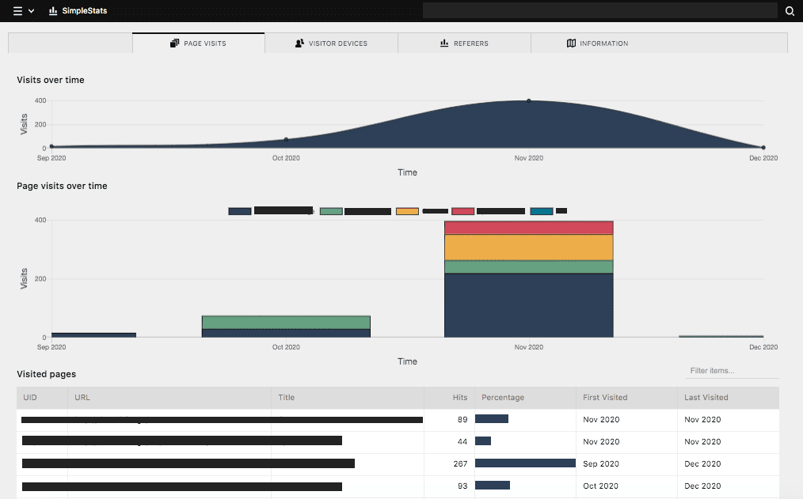
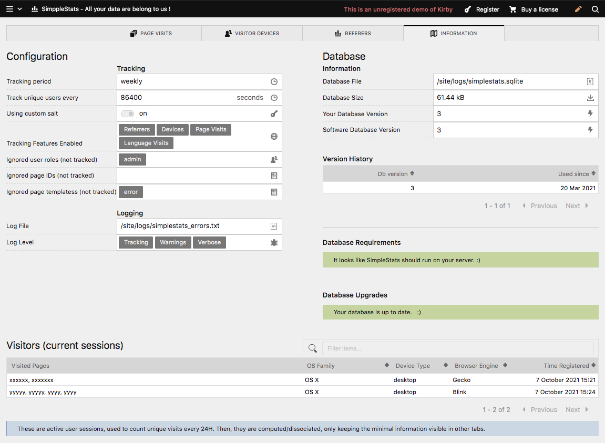

# SimpleStats

Track page views, referrers and devices on your Kirby 3 website.
This plugin provides a simple solution for **self-hosted**, **minimal** and **non-intrusive** visitor analytics.



- It tracks **referrer URLs** to keep track of who links to your website, categorised as either `search`, `social` or `website`.
- It tracks **device information** (device types, browser engine, OS family; all version-less) for keeping track of how your website is visited.
- It tracks **page visits**, counting 1 hit per page per unique user per language, every 24H.
- The collected data is stored in a **.sqlite database** (raw data) and can be visualised using Kirby's admin panel (computed).

### How it works
- Tracking happens when the page is served by Kirby.
- A crypted user-unique fingerprint is stored in order to track unique page views.
_The formula is `md5( trunc(IP) + trunc(UserAgent) + Salt )`, which still, according to GDPR, seems to be considered as personal data._
It's stored together with a list of visited pages, the device category (bot/mobile/desktop/tablet/other), the browser's engine (Gecko/Webkit/Blink/Other) and OS Family.
This data is kept for a very short amount of time to ensure only counting unique hits.
- After 24H, the collected data is processed and any user identifying data is deleted :
  - The visited pages' hit counts are incremented, globally and per language.
  - Device, Engine and OS Family are separately incremented.
- Referrers are processed immediately and are not bound to any user-related identifier.
- All data is summed up on a monthly basis by default. You can easily change this "timeframe" to `weekly` or your own custom timeframe utility.


### Current state
Consider this plugin beta. Any feedback or bug reports are welcome. It's been successfully running on multiple production websites for about a year. The tracking part is almost done, when the panel interface will be more polished, I'll consider a first release.
Please note that the database structure might evolve over time, until a more stable release is available (_for which you'll be able upgrade your old databases; the upgrade meccanism already works_).


### Contributing
I guess a lot of options could be added to suit the plugin for a wider variety of website setups. The panel interface could also be improved and translated.
Any contributions (discussions, reports, feedback and pull requests) are welcome, as long as the collected stats stay minimal and reasonably non-intrusive.

****


## Setup

### Requirements
 - A recent Kirby installation (currently tested with 3.5+) and support for SQLite3.
 - For a detailed report, check the `Information` tab in the plugin's panel view.
 

### Installation

- **Option 1** : Download  
Download and copy this repository to `/site/plugins/simplestats`.

- **Option 2** : Git submodule  
```
git submodule add https://github.com/daandelange/kirby3-simplestats.git site/plugins/simplestats
```
Eventually add `--depth 1` to discard the repo commit history. (saves disk space)

- **Option 3** : Composer  
`composer require daandelange/simplestats:~0.4-beta` (update with `composer update`)  
_Note: While `SimpleStats` is still alpha, there is no stable channel for composer, so you need to specify the unstable version._

****

### Configuration

*Soon...*

For now, check the comments in `options.php` for directions.

#### Stats blueprint section
If you wish to display page stats in a section, you may add a `pagestats` panel section to your page's blueprint.
````yml
sections:
  pagestats:
    type: pagestats
    headline: TestHeadline
    size: small
    showTotals: true
    showTimeline: true
    showLanguages: true
    showFullInfo: false
````

#### Language setup
Multi-language websites are supported. For each page, there's a global counter, with an optional counter for each language.  
*Warning:* Do not add or remove languages to your Kirby installation without resetting your database file.  
Also, the panel view has not (yet?) been translated.

#### Database Configuration
The database file is a simple `.sqlite` file that holds all tracking data. You can view it from the dedicated panel area, or by including smaller widget sections in the panel page editor. The popular Sqlite format allows you to easily grab the data and visualise it your way, or import it in other software.  
It's recommended to occasionally backup your stats database file.

> ##### Tracking Resolution and Kirby Languages (Important !)
> Please note that *the database is tightly bound to the tracking resolution* option (`daandelange.simplestats.tracking.timeFrameUtility`) and *can not* be changed afterwards. Changing the resolution while keeping the same database file results in unefined behaviour.  
> The same goes for Kirby's Language setup: *if you change your multilanguage settings*, you need to create a new database file (however, manually editing the previous database file, you might be able to preserve your data).  
> This [could be automated with update scripts](https://github.com/Daandelange/kirby3-simplestats/issues/14).

> ##### Generating Stats
> If you'd like to populate the database with some fake stats (useful for testing or developing SimpleStats), you can use the panel interface to generate some in the "Information" tab.

#### Legal configuration
Depending on your local laws, you might need to sit down and define how personal visitor data is handled.
You might want to inspect the source code to know what's going on in details.
As the license states, there's no guarantee whatsoever.

#### Options
Like any Kirby plugin, options can be set in your `site/config/config.php`.  
All available options are listed and explained in `src/config/options.php`.  
Example :
````PHP
// site/config/config.php
require_once(__DIR__ . '/../plugins/simplestats/src/models/SimpleStatsTimeFrameUtility.php');
return [
  // [...] your options ...

  // Simplestats
  'daandelange.simplestats.panel.enable' => false, // Disable the panel view completely
  'daandelange.simplestats.tracking.enableReferers' => false, // Disable referer tracking
  'daandelange.simplestats.tracking.timeFrameUtility' => new \daandelange\SimpleStats\SimpleStatsTimeFrameUtilityWeekly(), // Here you can put your custom inherited class from SimpleStatsTimeFrameUtility
  'daandelange.simplestats.tracking.timeFrameUtility' => 'weekly', // Alternative
];
````

Here's a list with options that have been tested. (the `daandelange.simplestats` part has been stripped)

| Option                          | Type                                  | Default         | Description                                                                | Comment                                                                           |
|---------------------------------|---------------------------------------|-----------------|----------------------------------------------------------------------------|-----------------------------------------------------------------------------------|
| **TRACKING**                    |                                       |                 |                                                                            |                                                                                   |
| `tracking.timeFrameUtility`     | String \| SimpleStatsTimeFrameUtility | `'monthly'`     | Set the class that handles time conversions to periods. (read note below!*)| Possible string values: `monthly`, `weekly`.                                      |
| `tracking.enableReferers`       | Bool                                  | true            | Enables tracking referrers. Gives an insight of who links to your website. |                                                                                   |
| `tracking.enableDevices`        | Bool                                  | true            | Enables tracking of minimal hardware configurations (device information)   |                                                                                   |
| `tracking.enableVisits`         | Bool                                  | true            | Enables tracking page visits (frequentation)                               |                                                                                   |
| `tracking.enableVisitLanguages` | Bool                                  | true            | Enables a counter per language per page.                                   | Only effective in multi-language Kirby installations and `enableVisits` enabled.  |
| `tracking.ignore.roles`         | Array                                 | `['admin']`     | Ignore any tracking for connected users with these roles.                  |                                                                                   |
| `tracking.ignore.pages`         | Array                                 | `[]`            | Ignore tracking for these page ids.                                        | Make sure to use the full id, not the slug.                                       |
| `tracking.ignore.templates`     | Array                                 | `['error']`     | Ignore tracking for pages with these templates.                            | Checked against `template()` and `intendedTemplate()`                               |
| `tracking.ignore.bots`          | Bool                                  | false           | Ignore tracking any bots.                                        |                                                                                   |
| `tracking.ignore.botVisits`     | Bool                                  | true            | Ignore counting bot page views.                                            |                                                                                   |
| `tracking.ignore.botReferers`   | Bool                                  | true            | Ignore tracking referrers sent by bots.                                    |                                                                                   |
| `tracking.salt`                 | String                                | `'CHANGEME'`    | A unique hash, used to generate a unique user id from visitor data.        | Recommended to change, ensures that user identifying information is hard to retrieve if your database leaks. |
| `tracking.anonimizeIpBits`      | Number                                | `1`             | Anonymise the IP address of X bits.                                        | Use `0` for no anonymisation, `4` for full anonymisation. |
| `tracking.method`               | SimplestatsTrackingMode               | `onLoad`        | Tracking mode. See `SimplestatsTrackingMode` for more information.         | `onLoad` is the only fully automatic mode, others need manual attention.          |
| **PANEL**                       |                                       |                 |                                                                            |                                                                                   |
| `panel.dismissDisclaimer`       | Bool                                  | false           | Dismisses the panel disclaimer message.                                    |                                                                                   |
| `panel.enable`                  | Bool                                  | true            | Enable/Disable viewing stats in the panel.                                 |                                                                                   |
| `panel.authorizedRoles`         | Array                                 | `['admin']`     | User roles that are allowed to view statistics from the panel.             |                                                                                   |
| `panel.breadcrumbLabel`         | String                                | `'SimpleStats'` | Breadcrumb shown in the panel.                                             |                                                                                   |
| `panel.hideBots`                | Bool                                  | false           | To hide bot information from the devices tab.                              |                                                                                   |

* : Note - You have to choose the `timeFrameUtility` setting **before the initialisation**. If you'd like to change it afterwards, you'll not be able to import the previously collected data. Changing `timeFrameUtility`, you need to replace the database file with a new one (or manage to convert it).

### Updating
Before updating, make sure to **backup your database file**. If something goes wrong, you'll be able to retrieve your stats by replacing the database file later.

Depending on the installation method you used, proceed to the logical steps to update.

After updating:
- Review new options and configure as wished.
- Sometimes, a database upgrade is needed. If so, head to the panel's `Information` tab and follow instructions in the upgrade section.
- It's also a good idea to check the log file for any errors.

****

## API

### Singletons
- `SimpleStats::safeTrack($id)`
  Throw-safe alternative of `track()`. `$id` is a `$page->id()` to be tracked.
- `SimpleStats::track($id)`
  Function called to track user data. `$id` is a `$page->id()` to be tracked.

### Page Methods
- `$page->simpleStatsImage()`
  HTML code for the tracking image, when using OnImage tracking method.
- `$page->getPageStats()`
  Returns an array with useful tracking information about the page.

### User Methods
- `$user->hasSimpleStatsPanelAccess($forSpecialAdminAccess=false)`
  Returns true if the user is authorized to access the SimpleStats Panel, with or without special admin rights.
****

## Panel Interface

### Charts
Charts are interactive, you can hover them to have details, and click labels to toggle filtering. You can even download timelines as PNGs.

### Tables
Tables are interactive and paginated. You can search data within and sort them by clicking on the column headers.


****

## Development

Development was started from [a standard Kirby PluginKit](https://github.com/getkirby/pluginkit/tree/4-panel), see [their plugin guide](https://getkirby.com/docs/guide/plugins/plugin-setup-basic) for more details on using it.
*These steps are optional, for building development versions.*

- Npm requirements (optional) : `npm install -g parcel-bundler`
- Setup                       : `cd /path/to/website/site/plugins/simplestats && npm install`
- While developing            : `npm run dev`
- Compile a production build  : `npm run build`
- Update dependencies         : `npm update`


****

## Powered by

- [xaksis/vue-good-table](https://github.com/xaksis/vue-good-table) : Table component for the SimpleStats panel interface. [*MIT*]
- [ChartKick](https://chartkick.com) using [Chart.js]() for displaying interactive charts. [*MIT*]
- Package managers and packers : NPM, Parcel, Composer, Yarn.
- [Kirby CMS](https://getkirby.com) : Providing the plugin interface [[*licensed software*](https://getkirby.com/license)]
- [WhichBrowser/Parser-PHP](https://github.com/WhichBrowser/Parser-PHP) : an accurate and performant php user-agent parser.  [*MIT*]
- [Snowplow/php-referer-parser](https://github.com/snowplow-referer-parser/php-referer-parser) : a performant php refer(r)er parser. [*MIT*]

## Alternatives / Similar

- [DistantNative/retour-for-kirby](https://github.com/distantnative/retour-for-kirby) : Manage redirects and track 404s right from the Panel.
- [Bnomei/Pagecounter](https://github.com/bnomei/kirby3-pageviewcounter) : Count page hits and last visited date on your Kirby pages.
- [SylvainJulé/kirby-matomo](https://github.com/sylvainjule/kirby-matomo) : A Matomo wrapper for Kirby.
- [FabianSperrle/kirby-stats](https://github.com/FabianSperrle/kirby-stats) : Simple stats for Kirby 2.

## License

- [MIT](./LICENSE.md) - Free to use, free to improve.

- Copyright 2020-2021 [Daan de Lange](https://github.com/daandelange)
